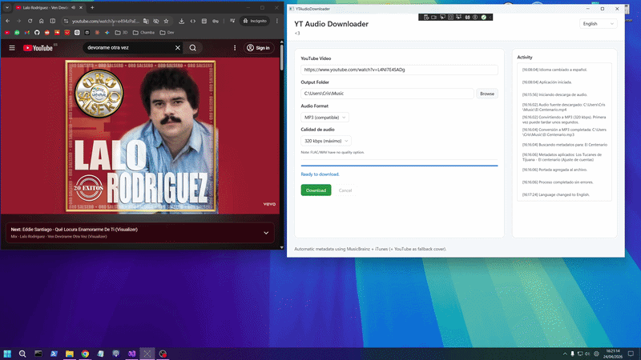

# YT Audio Downloader

Una app de escritorio hecha con WinUI 3 para descargar el audio de un video de YouTube, convertirlo al formato que prefieras y guardarlo con metadatos (artista, album, portada, etc.) de forma automatica.

Esta pensada para ser rapida, simple y sin menus raros: pegas enlace, eliges carpeta, formato y calidad, y listo.

## Que hace

- Descarga audio desde enlaces de YouTube
- Convierte a MP3, AAC, Opus, FLAC o WAV
- Permite elegir calidad (128/192/256/320 kbps en formatos con perdida)
- Intenta completar metadatos usando MusicBrainz + iTunes
- Usa portada alternativa desde YouTube si hace falta
- Interfaz en Espanol e Ingles
- Compatible con Windows x86, x64 y ARM64

## Stack y dependencias

- .NET 8
- WinUI 3 (Windows App SDK)
- YoutubeExplode
- Xabe.FFmpeg + Xabe.FFmpeg.Downloader
- TagLibSharp

## Requisitos

- Windows 10/11
- .NET SDK 8.0 (si lo vas a compilar)
- Conexion a internet

## Ejecutar en local

1. Clona el repositorio.
2. Restaura paquetes:

   dotnet restore YTAudioDownloader.slnx

3. Compila:

   dotnet build YTAudioDownloader.slnx

4. Ejecuta:

   dotnet run --project YTAudioDownloader/YTAudioDownloader.csproj

## Publicacion

El proyecto ya incluye perfiles de publicacion para Windows en:

- YTAudioDownloader/Properties/PublishProfiles/win-x86.pubxml
- YTAudioDownloader/Properties/PublishProfiles/win-x64.pubxml
- YTAudioDownloader/Properties/PublishProfiles/win-arm64.pubxml

## Notas

- El primer uso puede tardar unos segundos extra mientras se prepara FFmpeg.
- Si no se consiguen metadatos, el audio se guarda igual para no frenar el flujo.
- Usa esta herramienta solo con contenido que tengas derecho a descargar o convertir.

## Licencia

Este proyecto esta licenciado bajo **GNU General Public License v3.0 (GPL-3.0)**.

Puedes leerla completa en el archivo [LICENSE](LICENSE).
